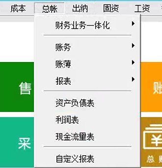
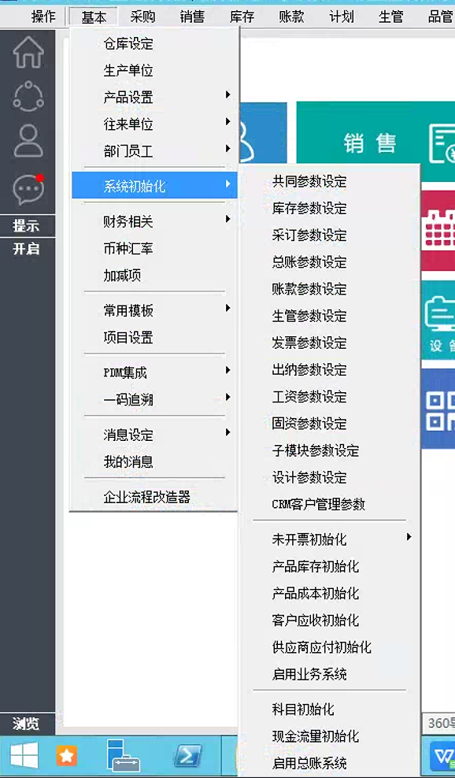
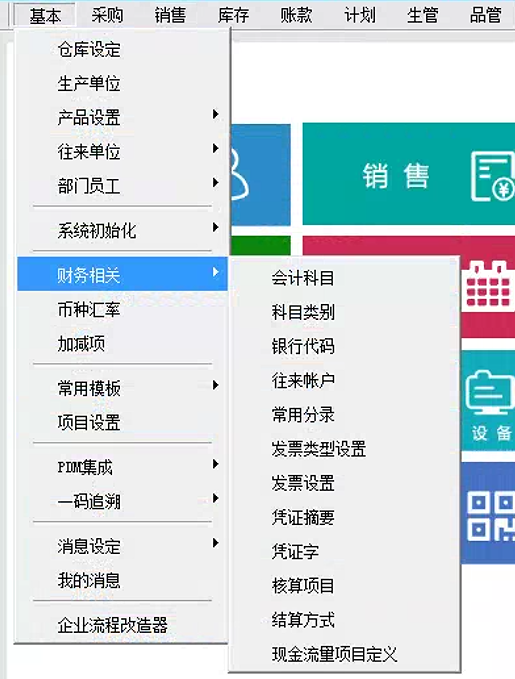

# 总账

----
  

## 基础资料设置  初始化  财务模块配置

<figure class="third">

</figure>

### 1.财务相关设置

1. 会计科目增删改查  路径：基本—>财务相关—>会计科目 
2. 银行设置
   1. 银行代码 增删改查 路径：基本—>财务相关—>银行代码
   2. 账户 增删改查  路径：基本—>财务相关—>往来账户

3. 常用分录设置  路径：基本—>财务相关—>常用分录
4. 发票类型设置 路径：基本—>财务相关—>发票类型设置
5. 凭证摘要设置 路径：基本—>财务相关—>凭证摘要设置

### 2.模块初始化相关设置

1. 未开票初始化 路径：基本-系统初始化-未开票初始化-采购未到票初始化/销售未到票初始化
2. 科目初始化 路径：基本-系统初始化-科目初始化   核算科目初始化
3. 出纳初始化 路径：出纳-初始化-出纳初始数据/启用出纳系统
4. 固资初始化 路径：固资-基本设置-固资初始化

### 2.业务模块系统操作

1.
