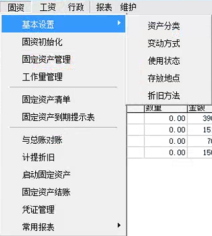

# 固定资产模块系统操作

固定资产模块是高格ERP系统中用于管理企业固定资产全生命周期的重要组成部分，涵盖资产新增、计提折旧、与总账对账等功能。

## 开启流程 固定资产基本设置，初始化数据，启动固定资产

## 1. 资产新增

- **路径**：`固资` -> `固定资产管理`
- **操作**：
  - 选择资产分类，资产编码自动生成流水号。
  - 输入资产名称，选择使用状态和变动方式。
  - 输入固资科目、累计折旧科目，以及使用部门、折旧费用分摊部门。
  - 在原值与折旧界面输入资产原值、使用期间数、累计折旧等数据。

## 2. 计提折旧

- **路径**：`固资` -> `计提折旧`
- **操作**：
  - 选择凭证字，并输入凭证摘要。
  - 点击“计提折旧”，系统自动生成折旧凭证至总账。

## 3. 与总账对账

- **路径**：`固资` -> `与总账对账`
- **操作**：
  - 根据所选期间，查询资产模块与总账模块对账信息。

## 4. 固定资产结账

- **路径**：`固资` -> `固定资产结账`
- **操作**：
  - 资产折旧后，可以进行资产模块结账。
  - 点击“开始”，系统自动结账，固定资产进入下一期间。

## 7. 固定资产管理

- **路径**：`固资` -> `固定资产管理`
- **操作**：
  - 录入固资系统启用后，购入的固资卡片。
  - 如果本期的卡片需要修改，直接点击修改进行内容的编辑。
  - 对固资进行清理时，点击“清理”按钮，录入清理的数量、费用、收入、变动方式。

## 8. 凭证管理

- **路径**：`固资` -> `凭证管理`
- **操作**：
  - 对本期购入、变更（原值变化）、清理的固定资产可以通过凭证管理生成到总账凭证里，并建立关联关系。
